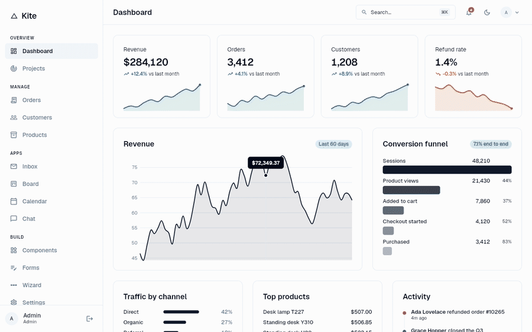

<!--
  README ORDER IS DELIBERATE — do not rearrange.
  Derived from the format that earned 20,000+ stars across eight repos in this niche:
    1. Live preview link   (line one, above everything)
    2. Video link          (line two)
    3. Keyword-dense prose (real sentences containing "flutter dashboard template")
    4. Packages used
    5. Animated GIF        ← THE product. Not a screenshot.
  See docs/DISTRIBUTION.md before editing.
-->

# Kite — Flutter Admin Dashboard Template

## [Live Preview](https://demo.dashboardpack.com/kite/) · [Download APK](#) · [TestFlight](#)

<!-- TODO: build-along video. The one distribution channel proven to work in this niche. -->
**[Watch the build-along on YouTube](#)**

Kite is a free, open-source **Flutter dashboard template** for teams who already ship a Flutter app
and now need the admin panel to go with it — same models, same API client, same language, same
team. No React to learn, no second stack to maintain.

This **Flutter admin dashboard template** runs from one codebase on the web, iOS, Android, macOS
and Windows. Clone it and run it: the mock data provider means you get a fully working admin with
realistic data before you have written a line of backend code.



*Light and dark, the ⌘K command palette searching real records, a data table with
server-side pagination, drag-and-drop on the board, and the component showcase.
Recorded from the running app with `tools/record-demo.mjs`.*

## What is in it

**22 screens** — three dashboards, five auth screens, list/detail/create/edit for
three resources, inbox, board, calendar, chat, a component showcase, forms, a
multi-step wizard, settings, profile, and both error pages.

## Why Kite

- **A data table that actually works** — server-side pagination, sorting and filtering, wired up, not stubbed.
- **Swap in your backend in one file** — implement `DataProvider` once and all 22 screens work. Ships with mock, REST and Supabase adapters.
- **Genuinely current** — Flutter 3.47 / Dart 3.13, with a CI matrix that proves it builds green on six targets, every week.
- **Mobile is not a reflow** — bottom navigation, card lists, full-screen forms. Not a squeezed desktop layout.
- **MIT licensed.** Free for commercial use, no attribution required, no asterisk.

## Getting started

```bash
git clone https://github.com/ColorlibHQ/kite-flutter-admin-dashboard
cd kite-flutter-admin-dashboard
flutter pub get
flutter run
```

## Packages we are using

- shadcn_ui — [pub.dev](https://pub.dev/packages/shadcn_ui)
- go_router — [pub.dev](https://pub.dev/packages/go_router)
- riverpod — [pub.dev](https://pub.dev/packages/riverpod)
- fl_chart — [pub.dev](https://pub.dev/packages/fl_chart)
- trina_grid — [pub.dev](https://pub.dev/packages/trina_grid)

## Docs

**[Full documentation →](https://docs.dashboardpack.com/kite-docs/)**
— getting started, connecting a backend, adding a resource, theming, localisation
and deployment. Source in [`docs/site/`](docs/site/).

- [Architecture](docs/ARCHITECTURE.md) — the one rule, the layout, and the `DataProvider` contract
- [Distribution](docs/DISTRIBUTION.md) — why this README is ordered the way it is
- [Deploy](docs/DEPLOY.md) — R2 buckets, base-href, purging, and what the SEO worker already handles
- [Spike A](docs/SPIKE-A.md) / [Spikes B & C](docs/SPIKE-B-C.md) — the measurements the build rests on

## License

MIT © [Colorlib](https://colorlib.com) — the team behind [AdminLTE](https://github.com/ColorlibHQ/AdminLTE).
